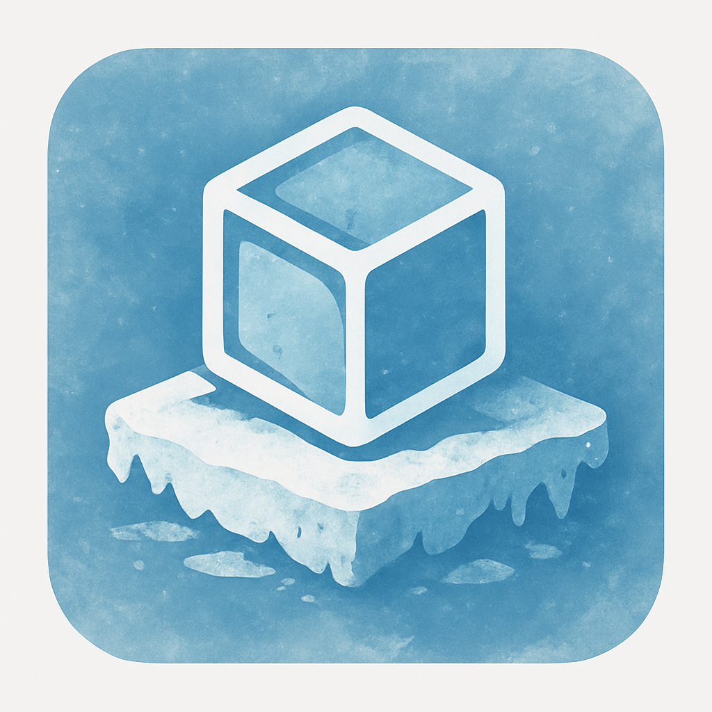

# Icebar
__Maintainer:__ :ice_cube: Microttus



An docker application developed for bspwm and i3, made to be super simple and static. Running with a GO backend

## TODO

**Features**

- [ ]  Auto Hide
- [x]  Margin from config
- [x]  Box style (box/~~island~~/none)
- [x]  Set monitor from config (must be handled in wm config)
- [ ]  Running-state dot integration
- [x]  Dynamic config path on launch (--config)
- [ ]  Paper basket option
- [x]  Transparency for background
- [ ]  Box style (island)
- [x]  Verbose logging
- [ ]  Magnification on hover

## File structure

```text
icebar/
├── cmd/
│   └── icebar/
│       └── main.go
├── pkg/
│   ├── config/
│   │   ├── config.go
│   │   └── parser.go
│   ├── dock/
│   │   ├── dock.go
│   │   └── item.go
│   ├── gui/
│   │   ├── gui.go
│   │   └── events.go
│   ├── launcher/
│   │   └── launcher.go
│   └── utils/
│       └── helpers.go
├── assets/
│   └── icebar/
│   │   ├── apps.toml
│   │   └── config.toml
│   └── images/
│   │   ├── icebar.png
│   │   └── icebar.svg
├── go.mod
├── go.sum
└── README.md

```
